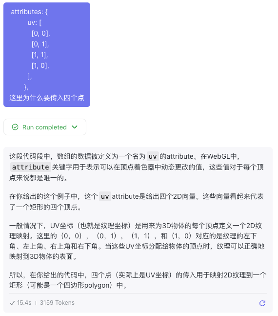
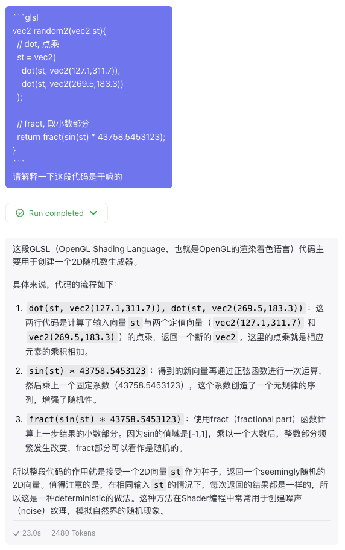

# Cells Shader 收获

## 1. Shader 初始化

使用`gl-renderer` API 来初始化。

```ts
const renderer = new GLRenderer(canvasRef);

const program = renderer.compileSync(FRAG_GLSL, VERTEX_GLSL);
renderer.useProgram(program);

renderer.setMeshData([
  { 
    // 顶点坐标
    positions: [
      [-1, -1],
      [-1, 1],
      [1, 1],
      [1, -1],
    ],
    // 传入参数
    attributes: {
      // 纹理坐标
      uv: [
        [0, 0],
        [0, 1],
        [1, 1],
        [1, 0],
      ],
    },
    // delaunay 三角剖分
    cells: [
      [0, 1, 2],
      [0, 2, 3],
    ],
  },
]);

renderer.render();
```

## 2. 各种东西的作用

### 2.1 纹理坐标


### 2.2 噪声纹理


## 3. Shader 解析

### 3.1 Vertex Shader
```glsl
attribute vec2 a_vertexPosition;
attribute vec2 uv;

// 变量，可以在 vertex 和 fragment 之间传递
varying vec2 vUv;

void main() {
  gl_PointSize = 1.0;
  vUv = uv;
  // 2D 坐标系，原点在左上角
  gl_Position = vec4(a_vertexPosition, 1, 1);
}
```

### 3.2 Fragment Shader
```glsl
#ifdef GL_ES
precision highp float;
#endif

varying vec2 vUv;
uniform float uTime;

vec2 random2(vec2 st){
  // dot, 点乘
  st = vec2( 
    dot(st, vec2(127.1,311.7)), 
    dot(st, vec2(269.5,183.3)) 
  );
  
  // fract, 取小数部分
  return fract(sin(st) * 43758.5453123);
}

void main() {
  vec2 st = vUv * 10.0;

  float d = 1.0;

  // i 是方格的序号，f 是点在方格内的相对位置
  vec2 i_st = floor(st);
  vec2 f_st = fract(st);

  // vec2 p = random2(i_st);
  // d = distance(f_st, p);

  // 八个位置的邻居
  for(int i = -1; i <= 1; i++) {
    for(int j = -1; j <= 1; j++) {
      vec2 neighbor = vec2(float(i), float(j));
      vec2 p = random2(i_st + neighbor);
      p = 0.5 + 0.5 * sin(uTime + 6.2831 * p);
      d = min(d, distance(f_st, neighbor + p));
    }
  }

  // 半径 0.03 的点，d 为距离
  gl_FragColor.rgb = vec3(d) + step(d, 0.03);
  gl_FragColor.a = 1.0;
}

```